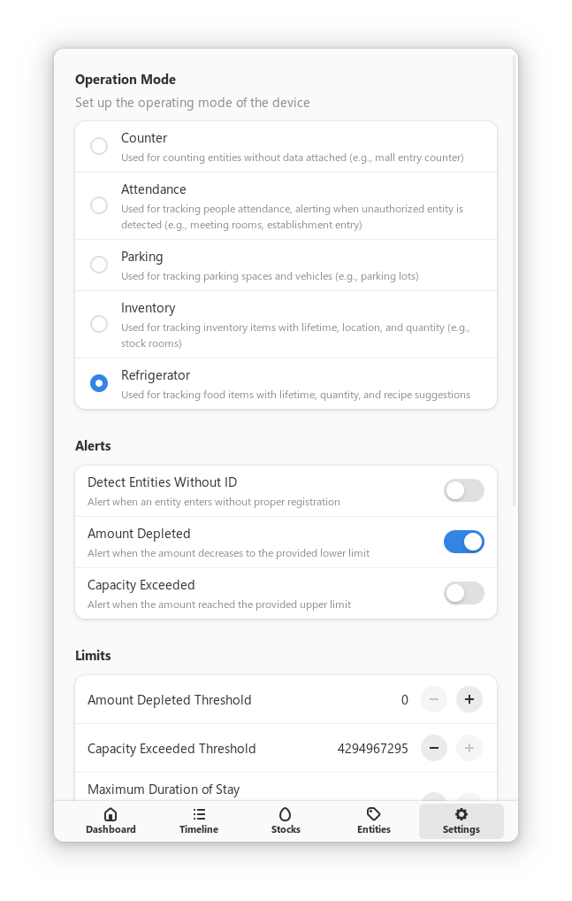

# Universal Entity Tracking System (UETS)

UETS is a universal system that tracks entities using RFID tags. It is designed to be used in a variety of applications, such as inventory management, establishment access control, and more.

## 🕹️ Operation Modes

### 🔢 Counter

This is used for entities that don't have any specific data (e.g., mall entry counter).

### 🕒 Attendance

This is used for tracking attendance, whereas unauthorized entities are not allowed to enter (e.g., classroom, meeting room, school gate, establishment entry).

### 🚗 Parking

This is used for tracking parking spaces and vehicles (e.g., parking lot).

This is useful for tracking how long a vehicle has been parked and whether it is authorized to park.

### 📦 Inventory

This is used for entities that have lifetime, location, and quantity (e.g., stock room, department store, medicine storage).

### 🧊 Refrigerator

This is used for entities that have lifetime and quantity (e.g., food storage).

This is experimental as it is labor-intensive to tag entities with this kind.

## ✨ Features

### 📊 Report Generation

- Filter by date range, entity ID, name, location, etc.
- Visualize data in a graph.
- Create report about depleting stocks, overflows, nearly expiring items, etc.
- Export as PDF or XLSX via QR code.

### ⏱️ Real-time Monitoring

- View entities entering and exiting in real-time.
- View real time statistics and graphs.
- Notify on stock depletion, capacity overflow, or expiring items.

### 🧾 Easy Data Handling

- Pre-input data via spreadsheet files.
- Support for BPSU CEA's QRifying system and national ID QR codes.

### 🤖 Automation

- Automatically control IoT devices, such as lights, doors, etc. based on entity count data.

### 🔒 Security

- Prevents unauthorized entities from entering, such as those without IDs or disallowed entities.
- Prevents overstay of entities. This is useful for parking lots, classrooms, arcade games, etc.

### 📈 Smart Data Analysis

- Provide insights on data.
- Detects anomalies in data, such as sudden increase in entity count, etc.
- Predicts future entity count based on historical data.
- Suggests optimal stock levels based on historical data.
- Provide recipes based on available stock.

## 🚀 Planned Features

1. Override timeline items for errors
2. Show license of all libraries
3. Implement local transfer wormhole
4. Support changing stock id
5. Consider entity name on sorter, etc.
6. Ability to filter entity data on report generation

## 📷 Screenshots

### Dashboard


#### Camera Live Feed


#### Detected Without IDs


#### Entity Gallery


#### Data Analyzer and Assistant


#### Advance Data Registration


### Timeline


### Entities View


#### Entity Details


#### Entity Details Editor


### Stocks View


### Report Generation


### Settings




### Date Time Range Picker


## 🏗️ Building and Running

1. Set up a toolbox container.
   - Run, `toolbox create --distro ubuntu --release 24.04`
2. Set up Rust via `rustup`.
   - Optionally, install `rust-analyzer` via `rustup component add rust-analyzer`.
3. Run `./setup` to install the required dependencies.
4. Run `./run` to build and run the project.

## 🔌 Setting up Raspberry Pi

### 🔃 Upload Code

1. Run the following command to upload or sync the code to the device:

```sh
rsync --filter=':- .gitignore' --exclude \".*/\" -aP ./ $REMOTE_DIR
```

### 🛠️ Setup Touchscreen Display

1. Set display orientation to portrait mode via GNOME Control Center.
2. Fix touchcreen calibration rules by adding the following to `/etc/udev/rules.d/99-calibration.rules`:

```
ATTRS{name}=="wch.cn USB2IIC_CTP_CONTROL", ENV{LIBINPUT_CALIBRATION_MATRIX}="0 1 0 -1 0 1"
```

3. Reboot the system.
